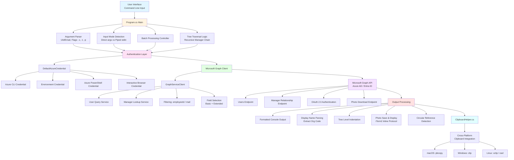
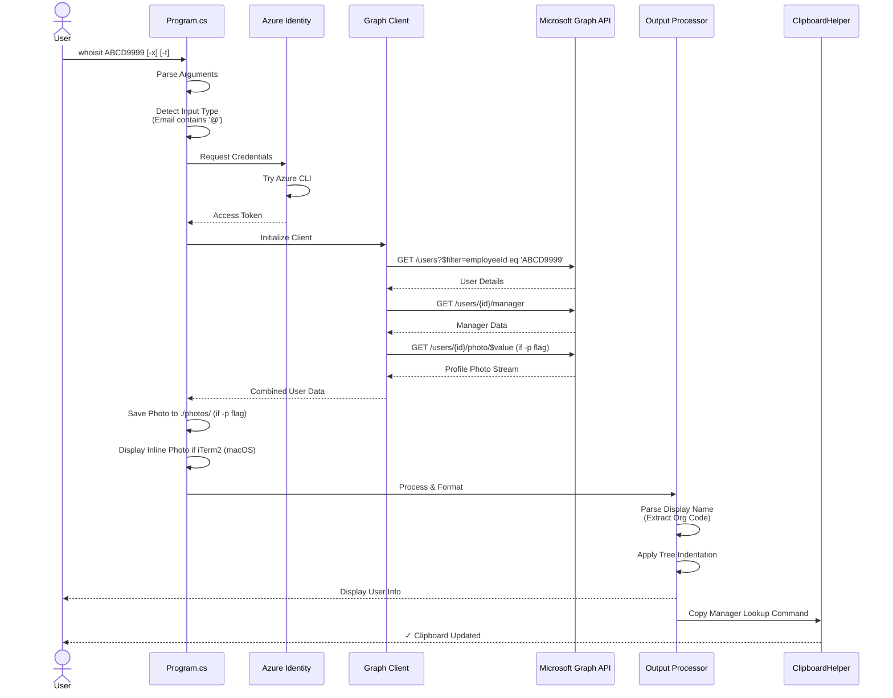
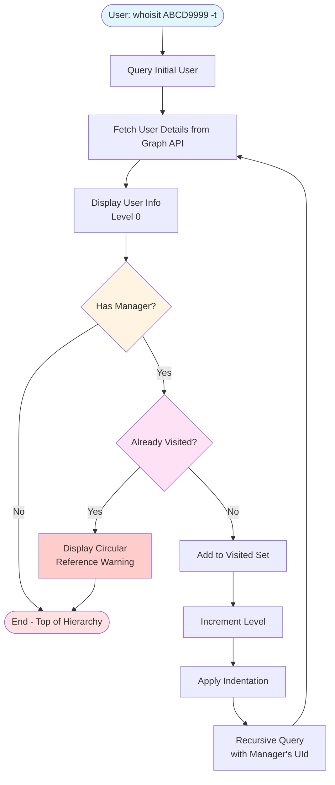
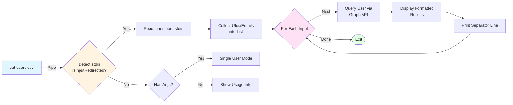

# WhoIsIt - System Architecture

## Overview

WhoIsIt is a cross-platform CLI tool that queries Azure Active Directory (Microsoft Entra ID) to retrieve user information. The application uses Microsoft Graph API to fetch user details and organizational hierarchy information.

## High-Level Architecture



## Component Details

### 1. **Program.cs (Core Application)**

**Responsibilities:**
- Parse command-line arguments and flags (`-x`, `-t`, `-p`)
- Detect input mode (direct arguments vs. piped stdin)
- Initialize authentication and Graph API client
- Orchestrate user query workflow
- Implement recursive manager tree traversal
- Download and save user profile photos
- Display inline photos in iTerm2 (macOS)
- Prevent circular reference loops with `HashSet<string>`

**Key Methods:**
- `ProcessUserWithTraversal()`: Main user processing and recursive manager lookup
- `IsITerm2()`: Detect iTerm2 terminal for inline photo display
- `DisplayPhotoInline()`: Display photo using iTerm2 inline image protocol
- Argument parsing logic for batch mode and tree traversal
- Pipe detection: `Console.IsInputRedirected`

### 2. **ClipboardHelper.cs (Cross-Platform Utility)**

**Responsibilities:**
- Provide cross-platform clipboard access
- Auto-copy manager lookup commands to clipboard
- OS-specific process invocation

**Platform Support:**
- **macOS**: Uses `pbcopy` command
- **Windows**: Uses `clip` command
- **Linux**: Uses `xclip` (primary) or `xsel` (fallback)

### 3. **Authentication Layer**

**Azure.Identity.DefaultAzureCredential** provides multi-method authentication:
1. Environment variables
2. Azure CLI (`az login`)
3. Azure PowerShell
4. Interactive browser (fallback)

**Scopes:** `https://graph.microsoft.com/.default`

### 4. **Microsoft Graph API Integration**

**Endpoints Used:**
- `GET /users?$filter={field} eq '{value}'` - User sear
- `GET /users/{id}/photo/$value` - User profile photo downloadch
- `GET /users/{id}/manager` - Manager lookup
- `GET /users/{id}` - User details with specific fields

**Query Fields:**

**Basic Mode:**
- id, displayName, userPrincipalName, mail
- employeeId, jobTitle, department, officeLocation
- mobilePhone, businessPhones

**Extended Mode (-x):**
- All basic fields plus:
- givenName, surname, companyName
- streetAddress, city, state, postalCode, country
- accountEnabled, createdDateTime, employeeHireDate, employeeType

## Data Flow

### Single User Query Flow



### Tree Traversal Flow (-t flag)



### Batch Processing Flow (Piped Input)



## Key Design Patterns

### 1. **Credential Chain Pattern**
Uses `DefaultAzureCredential` to attempt multiple authentication methods in sequence.

### 2. **Recursive Tree Traversal**
Implements depth-first traversal of organizational hierarchy with cycle detection.

### 3. **Cross-Platform Abstraction**
OS-specific implementations unified behind common interface (`ClipboardHelper`).

### 4. **Async/Await Pattern**
All Graph API calls use async operations for non-blocking I/O.

### 5. **Filter-Based Query**
Uses OData filters to perform server-side filtering on employeeId or email.

## Technology Stack

| Component | Technology |
|-----------|-----------|
| Runtime | .NET 9.0 |
| Language | C# 13 |
| Authentication | Azure.Identity v1.13.1 |
| Graph API | Microsoft.Graph v5.66.0 |
| Platform | Cross-platform (macOS, Windows, Linux) |
| Deployment | Self-contained single-file executable |

## Security Considerations

1. **Authentication**: Leverages Azure credential chain (no hardcoded credentials)
2. **Scope**: Limited to `https://graph.microsoft.com/.default`
3. **Access Control**: Inherits user's Azure AD permissions
4. **No Data Storage**: Queries are ephemeral; no local caching

## Error Handling

- User not found: Graceful error message
- Manager not accessible: Silently skips manager info
- Circular reference: Detects and breaks infinite loops
- Authentication failure: Fallback through credential chain
- Clipboard failure: Non-blocking (silent failure)

## Deployment Models

### Development
```bash
dotnet run <UId|EMAIL>
```

### Production (Single-File Executable)

#### macOS (ARM64)
```bash
dotnet publish -c Release -r osx-arm64 \
  --self-contained true \
  -p:PublishSingleFile=true
```

#### macOS (Intel x64)
```bash
dotnet publish -c Release -r osx-x64 \
  --self-contained true \
  -p:PublishSingleFile=true
```

#### Linux (x64)
```bash
dotnet publish -c Release -r linux-x64 \
  --self-contained true \
  -p:PublishSingleFile=true
```

#### Linux (ARM64)
```bash
dotnet publish -c Release -r linux-arm64 \
  --self-contained true \
  -p:PublishSingleFile=true
```

#### Windows (x64)
```bash
dotnet publish -c Release -r win-x64 \
  --self-contained true \
  -p:PublishSingleFile=true
```

#### Windows (ARM64)
```bash
dotnet publish -c Release -r win-arm64 \
  --self-contained true \
  -p:PublishSingleFile=true
```

**Artifacts:**
- Platform-specific binary (e.g., `whoisit` for macOS ARM64, `whoisit.exe` for Windows)
- All dependencies bundled
- No .NET runtime required on target machine
- Output location: `bin/Release/net9.0/{runtime-identifier}/publish/`

## Future Enhancement Opportunities

1. **Team Visualization**: Fetch and display direct reports
2. **Configuration File**: Custom field selection via config
3. **Offline Mode**: Cache for limited offline functionality
4. **Group Membership**: Display security and distribution groups
5. ***
